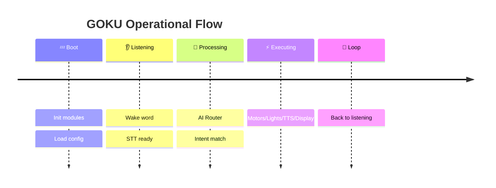

<div align="center">

```diff
+     ██████╗  ██████╗ ██╗  ██╗██╗   ██╗
+    ██╔════╝ ██╔═══██╗██║ ██╔╝██║   ██║
+    ██║  ███╗██║   ██║█████╔╝ ██║   ██║
+    ██║   ██║██║   ██║██╔═██╗ ██║   ██║
+    ╚██████╔╝╚██████╔╝██║  ██╗╚██████╔╝
+     ╚═════╝  ╚═════╝ ╚═╝  ╚═╝ ╚═════╝
```

<br>

<!-- ANIMATED SVG BANNER -->


<br>

# 🤖 **GOKU**
### **G**roq-integrated **O**perational **K**inetic **U**nit

**Mobile AI-Powered Surveillance Rover**  
*Active Perimeter Security · Natural Language Home Automation · Intelligent Autonomy*

[](https://www.raspberrypi.com/)
[](https://python.org)
[](https://groq.com)
[](https://deepmind.google/gemini)
[](https://www.espressif.com/)
[](LICENSE)

<!-- ANIMATED EYES - CSS art -->
<div>
  
  
  
</div>

<br>

<!-- PULSING STATUS BAR -->
<pre>
┌─────────────────────────────────────────────────────────┐
│ STATUS: <span style="color: #00ff00">■ ONLINE</span>  |  AI: <span style="color: #00ff00">■ GROQ + GEMINI</span>  |  HW: <span style="color: #00ff00">■ RPi5 + ESP32</span>  │
└─────────────────────────────────────────────────────────┘
</pre>

</div>

---

## 🚀 **Overview**

**GOKU** is a **mobile, AI-powered surveillance rover** that unifies active perimeter security with industrial-grade home automation through **natural language interaction**. It runs on a **Raspberry Pi 5** with an **ESP32** microcontroller, a robotic chassis, camera, and display — all controllable via voice.

| Capability | Status |
|---|---|
| 🧠 **AI Cognition** — Dual LLM routing (Groq + Gemini) | 🟢 Operational |
| 🗣️ **Voice Control** — Natural language commands | 🟢 Operational |
| 🚗 **Autonomous Movement** — L298N motor chassis | 🟢 Operational |
| 📷 **Vision System** — Scene analysis, object detection | 🟢 Operational |
| 📡 **Bluetooth Following** — RSSI-based device tracking | 🟢 Operational |
| 🏠 **Home Automation** — 8-channel ESP32 relay control | 🟢 Operational |
| 🎵 **Media Playback** — YouTube search via voice | 🟢 Operational |
| ⏰ **Alarms & Timers** — Voice-scheduled alerts | 🟢 Operational |
| 🚨 **Email Alerts** — Gmail SMTP security notifications | 🟢 Operational |
| 🎭 **Animated HUD** — 60 FPS robot face on HDMI display | 🟢 Operational |

<!-- ANIMATED PROGRESS BAR -->
```diff
+ [████████████████████████████████████████] 100% DEPLOYMENT READY
```

<pre align="center">
  ╭──────────────────────────────────╮
  │  🤖  🔋  📡  🛰️  📷  🔊  🎛️  │
  ╰──────────────────────────────────╯
</pre>

---

## 🧠 **Architecture**

```
                    ┌──────────────────────────────────────────────────────────┐
                    │                     USER VOICE                           │
                    │          (USB Mic → ALSA → Google STT)                   │
                    └─────────────────────┬────────────────────────────────────┘
                                          │
                    ┌─────────────────────▼────────────────────────────────────┐
                    │              rover_controller.py (Orchestrator)          │
                    │              ↳ Intent Classification + Routing           │
                    └──────┬────────────────────────────┬──────────────────────┘
                           │                            │
          ┌────────────────▼──────────────┐  ┌─────────▼──────────────────────┐
          │    MOVEMENT / FOLLOWING       │  │      AI / QUERY PROCESSING     │
          │  ┌─────────────────────────┐  │  │  ┌──────────────────────────┐  │
          │  │ motor_control.py        │  │  │  │   ai_router.py           │  │
          │  │ bluetooth_follower.py   │  │  │  │   ↳ Intent Detection     │  │
          │  │ navigation.py           │  │  │  └──────┬───────────────────┘  │
          │  └─────────────────────────┘  │  │         │                      │
          └───────────────────────────────┘  │    ┌────┼────┬────┐            │
                                             │    │    │    │    │            │
          ┌───────────────────────────────┐  │  ┌─▼─┐ ┌▼──┐ ┌▼──┐ ┌▼───┐      │
          │    HOME AUTOMATION / MEDIA    │  │  │GRQ│ │GMN│ │WS │ │WTH │      │
          │  ┌─────────────────────────┐  │  │  └───┘ └───┘ └───┘ └────┘      │
          │  │ home_automation.py      │  │  └────────────────────────────────┘
          │  │ media_control.py        │  │
          │  │ email_notifier.py       │  │
          │  └─────────────────────────┘  │
          └───────────────────────────────┘

          ┌───────────────────────────────────────────────────────────────────┐
          │                      OUTPUTS                                      │
          │  ┌──────────┐ ┌──────────┐ ┌───────────┐ ┌────────┐ ┌─────────┐   │
          │  │  TTS     │ │ Pygame   │ │  L298N    │ │ ESP32  │ │  VLC    │   │
          │  │ (Speaker)│ │(Display) │ │ (Motors)  │ │ (Relay)│ │ (Music) │   │
          │  └──────────┘ └──────────┘ └───────────┘ └────────┘ └─────────┘   │
          └───────────────────────────────────────────────────────────────────┘
```

---

## 🔧 **Hardware Stack**

### 🖥️ **Raspberry Pi 5** — *The Brain*

| Component | Specification |
|---|---|
| **SoC** | BCM2712, quad-core Cortex-A76 @ 2.4GHz |
| **RAM** | 8GB LPDDR4X |
| **OS** | Raspberry Pi OS (64-bit) |
| **Motor Driver** | L298N via GPIO (software PWM) |
| **Camera** | Pi Camera Module 2 (CSI) / USB Camera |
| **Display** | HDMI 800×480 Pygame HUD |
| **Audio** | USB Mic + 3.5mm/HDMI Speaker |

<details>
<summary><b>📊 GPIO Pin Map</b></summary>

| GPIO | Function | Component |
|---|---|---|
| `GPIO 5` | IN1 | Motor A+ |
| `GPIO 6` | IN2 | Motor A- |
| `GPIO 13` | IN3 | Motor B+ |
| `GPIO 19` | IN4 | Motor B- |
| `GPIO 26` | ENA (PWM) | Motor Speed A |
| `GPIO 16` | ENB (PWM) | Motor Speed B |

</details>

### 🔌 **ESP32** — *Home Automation Controller*

| Relay | GPIO | Device |
|---|---|---|
| 1 | `D13` | 💡 Light 1 |
| 2 | `D12` | 🌬️ Fan |
| 3 | `D14` | ⛽ Pump Motor |
| 4 | `D27` | ❄️ AC |
| 5 | `D26` | 💡 Light 2 |

### ⚡ **Power Requirements**

- **Drivetrain**: 12V @ 2A
- **Logic**: 5V @ 3A
- **ESP32**: 5V USB

---

## 🤖 **AI & Services**

### **Language Models**

| Service | Model | Purpose |
|---|---|---|
| **Groq** 🟢 | `llama-3.3-70b-versatile` | Primary conversational AI, Q&A, navigation advice |
| **Gemini** 🟡 | `gemini-1.5-flash` / `2.0-flash` | Fallback LLM, weather, music, search synthesis |
| **Gemini Vision** 📷 | `gemini-1.5-flash` | Scene description, object/people detection, OCR |

### **Speech Pipeline**

- **STT**: Google Speech Recognition (`speech_recognition`)
- **TTS**: gTTS (primary) → espeak-ng (offline) → Piper TTS (ONNX local)
- **Audio Capture**: `arecord` via ALSA (`plughw:2,0`)

### **External APIs**

| Service | Purpose |
|---|---|
| 🔍 **DuckDuckGo** + **Brave Search** + **Wikipedia** | Web search & lookup |
| 🌤️ **wttr.in** | Weather data |
| 🎵 **YouTube** (`yt-dlp` + VLC) | Music playback |
| 📧 **Gmail SMTP** | Security email alerts |

---

## 🎮 **Voice Commands**

```mermaid
mindmap
  root((GOKU))
    🚗 Movement
      forward / backward
      left / right
      stop / reverse
      scan / investigate
      forward 5 seconds
    📡 Bluetooth
      follow me
      stop following
      save my device [MAC]
      set target
    🏠 Home
      lights on/off
      fan on/off
      pump on/off
      AC on/off
      all off
    🧠 AI Queries
      what do you see?
      where is my phone?
      how many fingers?
      read the text
      describe the room
    🌤️ Info
      weather in [city]
      what time is it?
      search for [topic]
      who is [person]?
    🎵 Media
      play [song] in [language]
      pause / resume / stop
    ⏰ Timer
      set alarm for 07:00
      set timer for 5 minutes
      list alarms / timers
```

---

## ⚡ **Quick Start**

### 1️⃣ Clone & Install

```bash
git clone https://github.com/yourusername/goku_4.git
cd goku_4
python3 -m venv venv
source venv/bin/activate
pip install -r requirements.txt
```

### 2️⃣ Configure API Keys

```bash
export GROQ_API_KEY="gsk_..."
export GOOGLE_API_KEY="AIza..."
export BLYNK_AUTH="..."
export EMAIL_SENDER="goku@example.com"
export EMAIL_PASSWORD="app_password"
export EMAIL_RECIPIENT="you@example.com"
export ESP32_IP="192.168.1.100"
```

> 💡 **Tip**: Set these permanently in `config.py` or your `.bashrc`.

### 3️⃣ Launch GOKU

```bash
sudo python3 main.py
```

### 4️⃣ Flash ESP32 Firmware

```
Open esp32_8channel.ino in Arduino IDE
Select board: ESP32 Dev Module
Upload via USB → Connect relays → Power cycle
```

---

## 📂 **Project Map**

<pre>
📁 <b>goku_4/</b>
├── <span style="color:#00ff00">▶</span> <a href="main.py">main.py</a>                 <span style="color:#666"># Entry point — system init</span>
├── <span style="color:#00ff00">▶</span> <a href="rover_controller.py">rover_controller.py</a>       <span style="color:#666"># Central orchestrator & command loop</span>
├── ⚙️ <a href="config.py">config.py</a>               <span style="color:#666"># GPIO pins, API keys, settings</span>
│
├── 🧠 <span style="color:#ff9900">AI ROUTER</span>
│   ├── <a href="ai_router.py">ai_router.py</a>            <span style="color:#666"># Intent classification & routing</span>
│   ├── <a href="groq_assistant.py">groq_assistant.py</a>       <span style="color:#666"># Groq LLM (Llama 70B)</span>
│   ├── <a href="gemini_assistant.py">gemini_assistant.py</a>     <span style="color:#666"># Gemini text model</span>
│   ├── <a href="gemini_vision.py">gemini_vision.py</a>        <span style="color:#666"># Gemini vision analysis</span>
│   └── <a href="web_search.py">web_search.py</a>           <span style="color:#666"># DuckDuckGo + Brave + Wikipedia</span>
│
├── 🗣️ <span style="color:#ff9900">SPEECH</span>
│   ├── <a href="speech_handler.py">speech_handler.py</a>       <span style="color:#666"># STT via Google Speech Recognition</span>
│   ├── <a href="tts_engine.py">tts_engine.py</a>           <span style="color:#666"># TTS (gTTS → espeak → Piper)</span>
│   └── <a href="edge_tts_helper.py">edge_tts_helper.py</a>      <span style="color:#666"># Microsoft Edge TTS helper</span>
│
├── 🚗 <span style="color:#ff9900">MOVEMENT</span>
│   ├── <a href="motor_control.py">motor_control.py</a>        <span style="color:#666"># L298N software PWM motor driver</span>
│   ├── <a href="bluetooth_follower.py">bluetooth_follower.py</a>   <span style="color:#666"># RSSI-based BT device tracking</span>
│   └── <a href="navigation.py">navigation.py</a>           <span style="color:#666"># Path planning & obstacle avoidance</span>
│
├── 🏠 <span style="color:#ff9900">HOME AUTOMATION</span>
│   ├── <a href="home_automation.py">home_automation.py</a>      <span style="color:#666"># ESP32 auto-discovery + HTTP relay</span>
│   ├── <a href="esp32_8channel.ino">esp32_8channel.ino</a>     <span style="color:#666"># 8-relay ESP32 firmware</span>
│   └── <a href="esp32_home_auto/esp32_home_auto.ino">esp32_home_auto.ino</a>    <span style="color:#666"># 5-relay variant</span>
│
├── 📷 <span style="color:#ff9900">VISION & DISPLAY</span>
│   ├── <a href="camera_stream.py">camera_stream.py</a>        <span style="color:#666"># Camera abstraction (Picamera2 + CV2)</span>
│   └── <a href="display_controller.py">display_controller.py</a>   <span style="color:#666"># Pygame animated robot face HUD</span>
│
├── 🎵 <span style="color:#ff9900">MEDIA</span>
│   ├── <a href="media_control.py">media_control.py</a>        <span style="color:#666"># YouTube search + VLC playback</span>
│   └── <a href="ringtone_manager.py">ringtone_manager.py</a>     <span style="color:#666"># Alarm/timer ringtone manager</span>
│
├── ⏰ <span style="color:#ff9900">SYSTEMS</span>
│   ├── <a href="alarm_system.py">alarm_system.py</a>         <span style="color:#666"># Threaded alarm clock</span>
│   ├── <a href="timer_system.py">timer_system.py</a>         <span style="color:#666"># Countdown timers (pause/resume)</span>
│   ├── <a href="weather_module.py">weather_module.py</a>       <span style="color:#666"># wttr.in weather API</span>
│   └── <a href="email_notifier.py">email_notifier.py</a>       <span style="color:#666"># Gmail SMTP security alerts</span>
│
├── 🛠️ <span style="color:#ff9900">UTILITIES</span>
│   ├── <a href="goku_utils.py">goku_utils.py</a>           <span style="color:#666"># Logging, timer, buffer, retry</span>
│   ├── <a href="alsa_suppress.py">alsa_suppress.py</a>        <span style="color:#666"># Suppress ALSA warnings</span>
│   ├── <a href="keypad_controller.py">keypad_controller.py</a>    <span style="color:#666"># WASD keyboard control thread</span>
│   └── <a href="diagnose_all.py">diagnose_all.py</a>         <span style="color:#666"># Hardware diagnostics</span>
│
├── 🎨 <span style="color:#ff9900">ASSETS</span>
│   ├── <a href="piper_models/">piper_models/</a>          <span style="color:#666"># Local ONNX TTS voice models</span>
│   ├── <a href="ringtones/">ringtones/</a>             <span style="color:#666"># WAV ringtone files</span>
│   └── <a href="requirements.txt">requirements.txt</a>       <span style="color:#666"># Python dependencies</span>
│
└── 📜 <span style="color:#ff9900">SCRIPTS</span>
    ├── <a href="run.sh">run.sh</a>                  <span style="color:#666"># Launch script (sudo + venv)</span>
    └── <a href="run_goku.sh">run_goku.sh</a>             <span style="color:#666"># Alternative launcher</span>
</pre>

---

## 🎨 **Display Animations**

The Pygame HUD renders a **real-time animated robot face** at 60 FPS:


---

## 📊 **Performance Benchmarks**

| Metric | Value |
|---|---|
| **AI Response Time** (Groq) | ~500ms — 1.5s |
| **AI Response Time** (Gemini) | ~1s — 3s |
| **Speech Recognition** (Google) | ~200ms — 1s |
| **Motor Response Latency** | < 50ms |
| **Display Frame Rate** | 60 FPS |
| **Camera Capture** | 30 FPS |
| **Bluetooth Scan Cycle** | ~2s |
| **Music Start Time** | ~3s — 5s |

---

## 🧪 **Diagnostics**

```bash
# Run full hardware diagnostics
sudo python3 diagnose_all.py

# Test motors individually
sudo python3 diagnose_motors.py

# Find ESP32 on network
python3 find_esp32.py

# Run pin diagnostics
sudo python3 pin_diagnostic.py
```

---



---

## 🔐 **Security**

- API keys are stored in `config.py` (excluded from `.gitignore`)
- Email alerts via **TLS-encrypted Gmail SMTP**
- Bluetooth following uses **RSSI only** — no data exfiltration
- ESP32 relays operate on **local network only**

---

## 📜 **License**

<div align="center">


[]()
[]()
[]()
[]()

<br>

```
  ╔══════════════════════════════════════╗
  ║     ▄▄▄▄▄▄▄  ▄    ▄ ▄▄▄▄▄▄▄          ║
  ║     █ ▄▄▄ █ ▀ ▀▄▀█ █ ▄▄▄  █          ║
  ║     █ ███ █ ▄▀▄▀▀█ █ ███  █          ║
  ║     █▄▄▄▄▄█ █ █▄▀▄█ █▄▄▄▄▄█          ║
  ║     ▄▄▄▄▄ ▄▄ ▄▄▀▄▄ ▄▄▄▄▄▄▄▄          ║
  ║     ▄▄█▄▀▄ █▄▄▀ ▀▄  ▄▄▄ ▄▄▄          ║
  ║     █▄▀ █▀▄ ▄▀▄▀▄▀█▄█ █ ▀█           ║
  ║     ▀▄▄▀▄█▀ █▄ █▄█ ▄▄▄ ▄▀█           ║
  ║     █ ▄▄▄ █ █▄▀ ▄▀ █▄█▄▄▀▀           ║
  ║     █ ███ █ █ ▄ ▄▄▀ ▄▄▄ ▄▄           ║
  ║     █▄▄▄▄▄█ ██▄▄▀▄▀▀▄▄█▄▄            ║
  ╚══════════════════════════════════════╝
```

</div>
